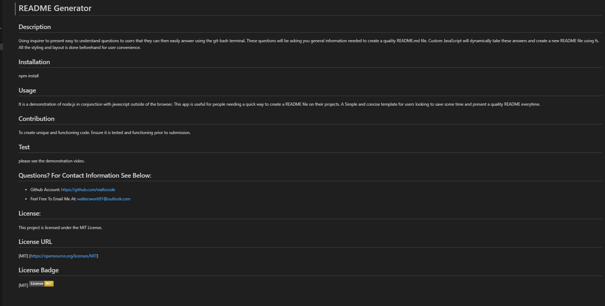

# README_Generator

## Description: 

- Welcome to a demonstration of what coding with node.js and javascript is capable of! 

- Using inquirer to present easy to understand questions to users that they can then easily answer using the git-bash terminal.

- To get started, ensure you have inquirer installed. Open up your git-bash terminal and type in 'npm i'.

- Simply type into the terminal 'node index.js' and you are presented with the first of a series of questions. 

- Upon answering your question, you will be automatically presented with the next question. These questions will be asking you general information needed to create a quality README.md file. 

- Once all questions have been answered, you will receive a notification saying 'Successfully created NewREADME.md!' 

- fs will then use the writeToFile() function to create a new README.md file ready for use complete with proper formatting and imagery. 

- Try it out!

## Acceptance Criteria 

- GIVEN a command-line application that accepts user input.

- WHEN I am prompted for information about my application repository, THEN a high-quality, professional README.md is generated with the title of my project and sections entitled Description, Table of Contents, Installation, Usage, License, Contributing, Tests, and Questions.

- WHEN I enter my project title, THEN this is displayed as the title of the README.

- WHEN I enter a description, installation instructions, usage information, contribution guidelines, and test instructions, THEN this information is added to the sections of the README entitled Description, Installation, Usage, Contributing, and Tests.

- WHEN I choose a license for my application from a list of options, THEN a badge for that license is added near the top of the README and a notice is added to the section of the README entitled License that explains which license the application is covered under.

- WHEN I enter my GitHub username, THEN this is added to the section of the README entitled Questions, with a link to my GitHub profile.

- WHEN I enter my email address, THEN this is added to the section of the README entitled Questions, with instructions on how to reach me with additional questions.

- WHEN I click on the links in the Table of Contents, THEN I am taken to the corresponding section of the README.

## Link To Repository

https://github.com/waltscode/README_Generator 

## Screenshot Of Application

## Your NEWLY Generated README.md File Will Look Something Like This

## Link To Demonstration Video: 

https://youtu.be/mxfI98bV6kI 